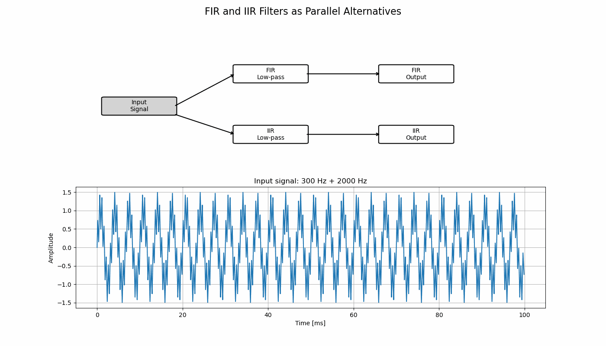
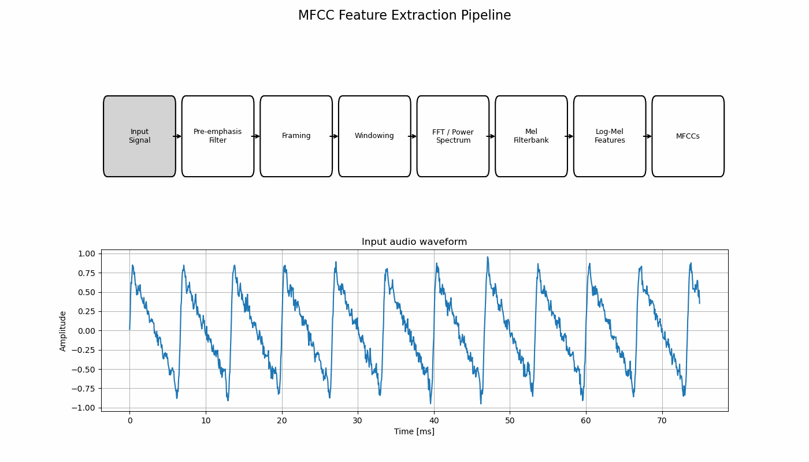

# Audio Signal Processing Pipeline

This project demonstrates basic audio signal processing concepts using Python.  
It focuses on two important parts of audio/DSP work:

1. Comparing FIR and IIR low-pass filters as parallel alternatives
2. Extracting MFCC features from an audio signal

The goal of this project is to show how raw audio signals can be processed, filtered, transformed, and prepared for feature-based analysis.

---

## 1. FIR and IIR Filters as Parallel Alternatives

The input signal contains two frequency components: a low-frequency component and a high-frequency component.

The same input signal is passed through two different low-pass filters:

- FIR low-pass filter
- IIR low-pass filter

This helps compare how FIR and IIR filters behave on the same signal.



### What this shows

- FIR and IIR filters are not used one after another.
- They are two separate filtering approaches applied to the same input signal.
- This allows comparison of their output behaviour, smoothness, delay, and filtering effect.

---

## 2. MFCC Feature Extraction Pipeline

This part demonstrates a basic MFCC feature extraction pipeline used in speech and audio processing.

The pipeline follows these steps:

1. Input audio signal
2. Pre-emphasis filtering
3. Framing
4. Windowing
5. FFT / power spectrum
6. Mel filterbank
7. Log-mel features
8. MFCC coefficients



### What this shows

The MFCC pipeline converts a raw time-domain audio waveform into compact features that describe the spectral shape of the signal.  
These features are commonly used in speech recognition, speaker identification, and audio classification.

---

## Technologies Used

- Python
- NumPy
- SciPy
- Matplotlib
- Jupyter Notebook

---

## Project Structure

```text
AudioSignalProcessingPipeline.ipynb
fir_iir_parallel_filtering.gif
mfcc_pipeline_animation.gif
README.md
